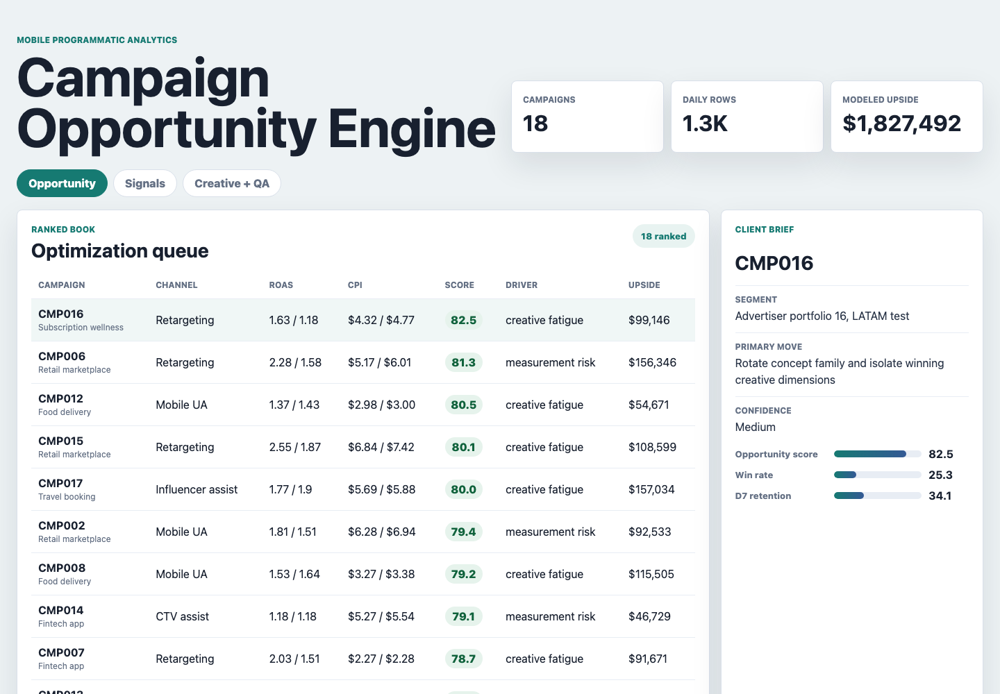
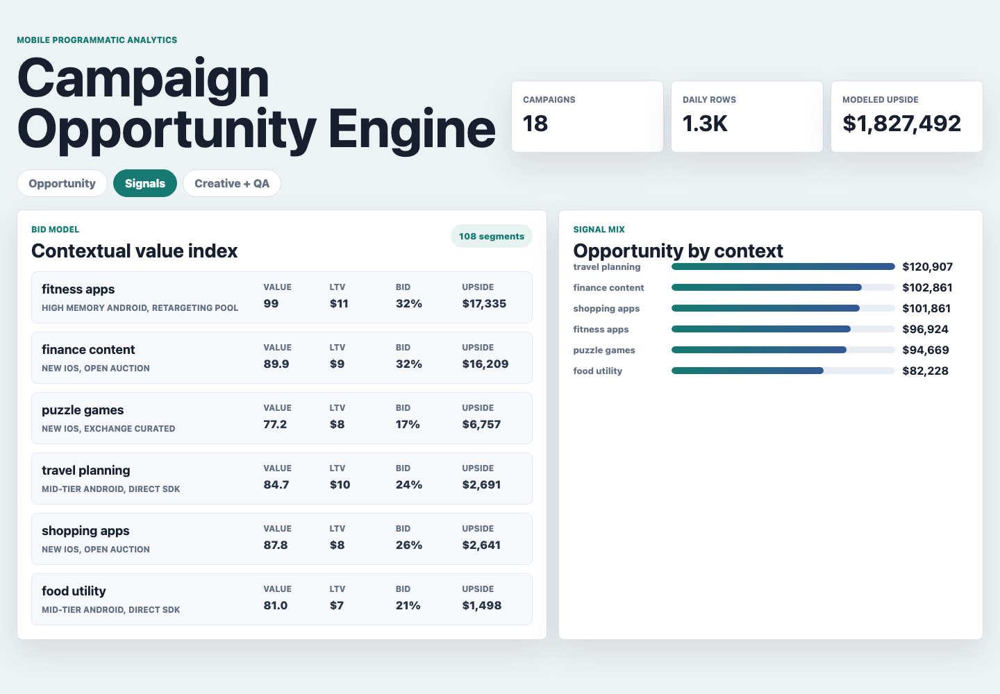
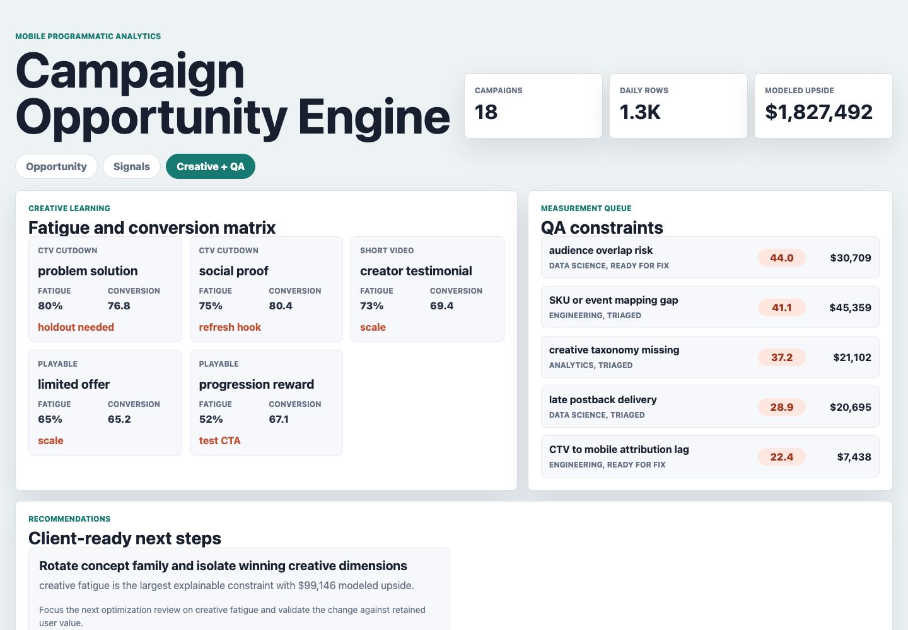

# Programmatic Campaign Opportunity Engine

A mobile programmatic advertising analytics workbench for identifying missing opportunity across campaign delivery, contextual bidding signals, creative performance, and measurement quality. It is designed for analyst roles where the work is not just reporting results, but deciding what should change next.

The project uses synthetic data because advertiser bidstream, mobile attribution, creative-level performance, and client account data are private. The data is labeled as synthetic and generated from documented assumptions.

## Screenshots



**Campaign opportunity cockpit:** Ranks a portfolio of mobile programmatic campaigns by modeled opportunity score, ROAS and CPI gaps, D7 retention, win rate, primary driver, confidence, and estimated missing opportunity.



**Contextual signal lab:** Shows the highest-value contextual bid segments for the selected campaign, including predicted value index, estimated LTV, recommended bid movement, and upside by app context.



**Creative and measurement QA console:** Connects creative fatigue, conversion learning, QA constraints, internal ownership, affected spend, and client-ready next steps.

## What This Demonstrates

- Campaign optimization across mobile UA, retargeting, CTV assist, and influencer assist channels.
- Missing opportunity analysis that separates bid gaps, ROAS pressure, CPI inflation, creative fatigue, and measurement risk.
- A transparent Python scoring model that converts noisy campaign signals into a ranked operating queue.
- BI-ready browser surfaces for analyst review, client conversations, and cross-functional follow-up.
- SQL-style checks for pacing, measurement reliability, contextual signal coverage, and recommendation ownership.

## Data

Run `npm run generate:data` to rebuild all synthetic datasets and analysis outputs with a fixed random seed.

Generated data files:

- `data/campaigns.csv`: 18 synthetic advertiser campaign records with channel, geo, objective, budget, target CPI, target ROAS, owner, and launch date.
- `data/daily_campaign_metrics.csv`: 1,260 campaign-day rows with spend, impressions, bid requests, win rate, installs, revenue, CPI, ROAS, D7 retention, pacing, contextual fit, signal coverage, creative fatigue, measurement reliability, and predicted value index.
- `data/contextual_bid_signals.csv`: 108 contextual bid segments across app context, device tier, supply path, predicted LTV, value index, win-rate gap, bid recommendation, and estimated opportunity.
- `data/creative_variants.csv`: 90 creative rows covering concept, format, spend share, thumbstop rate, conversion index, fatigue score, and learning tag.
- `data/measurement_qa_checks.csv`: 90 QA rows covering event mapping, postback delivery, audience overlap, CTV attribution lag, creative taxonomy, affected spend, severity, owner, and status.
- `data/client_recommendations.csv`: Client-facing action rows with business case, owner, and talk track.

Generated analysis outputs:

- `analysis/outputs/campaign_opportunity_queue.csv`
- `analysis/outputs/contextual_signal_scores.csv`
- `analysis/outputs/creative_learning_matrix.csv`
- `analysis/outputs/measurement_qa_queue.csv`
- `analysis/outputs/client_recommendations.csv`
- `analysis/outputs/summary.json`

The generator models common mobile programmatic structures: advertiser portfolios, campaign objectives, daily spend and delivery, impression-level bidding constraints aggregated into contextual segments, creative concept learning, postback or taxonomy QA issues, and account-level recommendations. Campaign opportunity score is calculated from ROAS gap, CPI gap, pacing gap, win-rate gap, creative fatigue, QA severity, and predicted contextual value. The model is intentionally explainable so an analyst can defend every recommendation.

## Role Connection

This artifact mirrors the work expected from a programmatic advertising analyst: optimize campaigns, analyze trends, identify missing opportunity, collaborate with Product, Data Science, Engineering, and Business Development partners, and own client-facing analytics conversations.

## Scope

This project does:

- Generate reproducible synthetic campaign and bid-signal data.
- Rank campaigns by modeled upside and explain the primary optimization driver.
- Provide three distinct browser surfaces for portfolio triage, signal-level analysis, and creative plus QA follow-up.
- Include SQL checks and narrative analysis notes for interview preparation.

This project does not:

- Use real advertiser, device, bidstream, mobile attribution, or campaign performance data.
- Claim to represent any specific company performance.
- Connect to a production DSP, MMP, warehouse, BI platform, or client reporting system.
- Replace causal lift measurement or a production-grade bidding model.

## Run Locally

```bash
npm run generate:data
npm start
```

Open `http://localhost:59512`.
